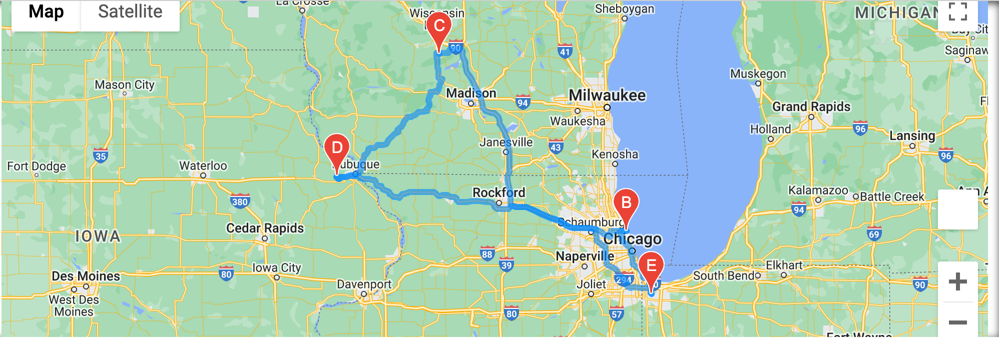
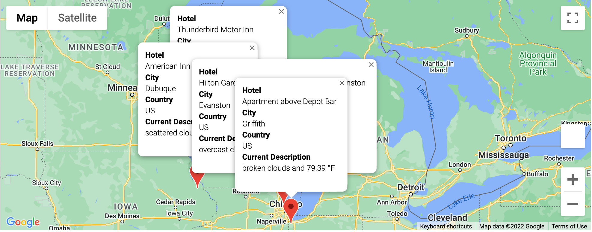

# World-Weather-Analysis

## Overview

In this project, several APIs were used to create two useful programs: the first shows hotels that meet the weather preferences of the user, and the second provides an optimal driving route given the cities the user would like to travel to. The making of these programs was made feasible through the use of the OpenWeatherMap API and the Google Maps API. This project illustrates the power and versatility of these tools when writing programs. 

## Methodology

First, 2,000 randomly generated coordinates (latitude and longitude) were generated. Using the CitiPy module, the nearest city to each set of coordinates was determined. Using the OpenWeatherMap API, current weather data for each city was recorded in a file called Weather_Database.csv. Then, using the Google Maps API, the nearest hotel to each city was mapped based on the users weather preferences (minimun and maximum preferred temperature). Each city had a marker that, when clicked, provides information on the name of the hotel, the city in which it was located, and the current weather description. 

Lastly, a program was made to test the power of the Google Directions API. Four cities within the same country were chosen. The cities were the following American cities: Griffith Illinois, Evanston Illinois, Baraboo Illinois, and Dubuque Iowa. The API was used to determine the optimal driving route starting and ending in Griffith. Then, the current weather description and hotel name was provided using markers from the Google Maps API.

## Results

The following are sample images of the program.

## Conclusion

The Google Maps API and OpenWeatherMap API are powerful tools that can notify travelers of important weather and transportation factors. Future work will involve choosing the actual coordinates to study, rather than choosing them randomly. In addition, the user's weather preferences could be expaned to include additional weather data, such as wind speed and humidity. Improving upon this current project will be feasible given the versatility of these APIs. 
